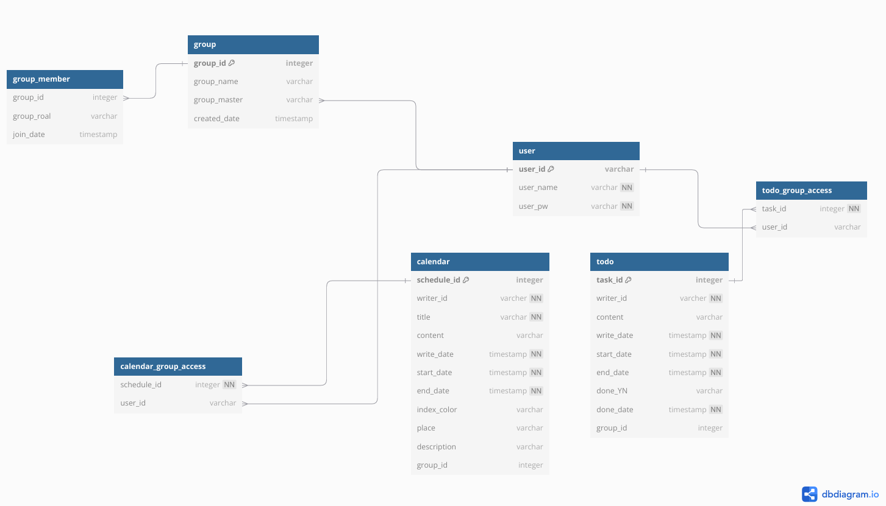
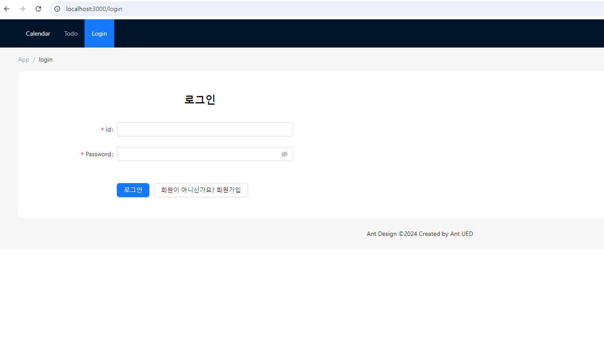
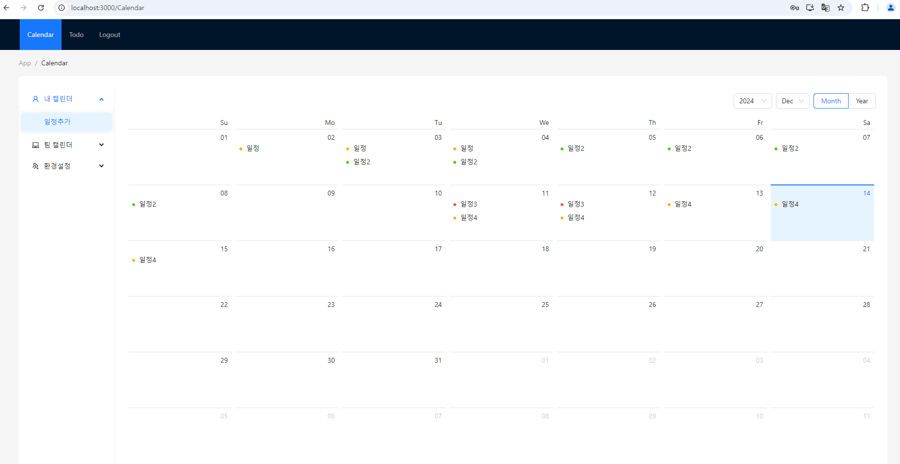
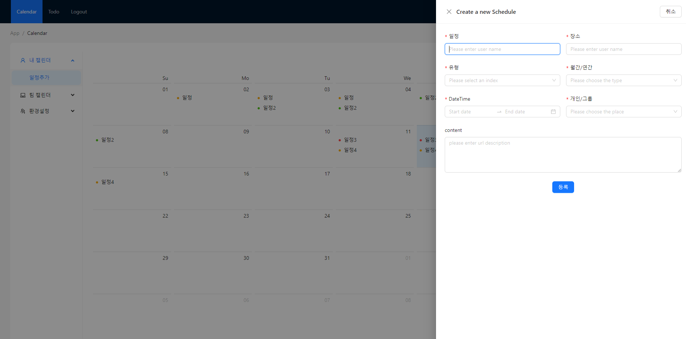
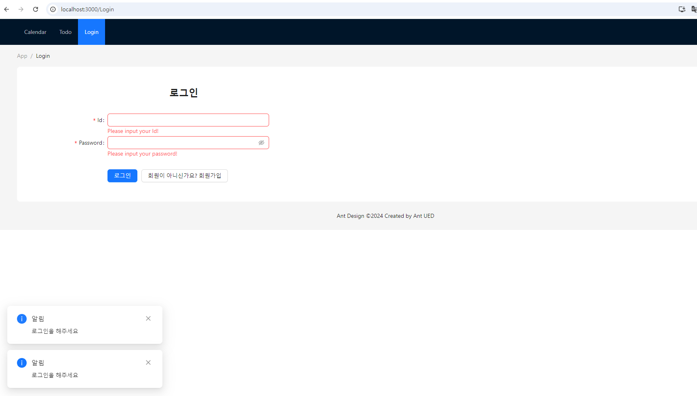

# 과제 frontend (미완성) 

과제 backend(미완성) -> (https://github.com/kaxpin/clush_backend)

##
안녕하세요! 개인 사정으로 과제의 요구조건을 수행하지 못했지만, 성장의 거름이 되고자 제출하게 되었습니다. 

### 1. 자신이 개발한 앱에 대한 설명  

비록 완성하지는 못했지만 

제가 초기에 구상했던 앱은 그룹끼리 공유하는 캘린더 앱입니다

기능적으로 구현한 부분은 일정조회, 등록입니다.

 

### 2. 소스 빌드 및 실행 방법 메뉴얼
node.js 와 npm을 설치하고 npm start를 터미널에 입력해서 개발 환경에서 소스를 실행하였습니다.
백엔드 API를 사용하기 위해서는 백엔드 서버가 필요하므로, 별도로 백엔드 서버를 구동시켜 API 요청을 처리할 수 있는 환경을 구성했습니다.

### 3. 주력으로 사용한 컴포넌트에대한 설명 및 사용 이유 기입
주력으로 사용한 컴포넌트는, CalendarApp 컴포넌트 입니다.
저는 캘린더가 앱에서 큰 비율로 차지한다는 생각으로 화면에 크게 위치시켰습니다.
ant design에 있는 컴포넌트들의 디자인을 최대한 가져가고 싶었고 컴포넌트가 다소 복잡하게 느껴져서
분리하여 재사용은 잘 하지는 못했다고 생각합니다.
CalendarApp이라는 큰 컴포넌트를 주력으로 하여 데이터를 불러오고 가공하고,
캘린더를 클릭했을때 사용성을 고려해서 if문으로 분기점을 나눴습니다. 

   
 